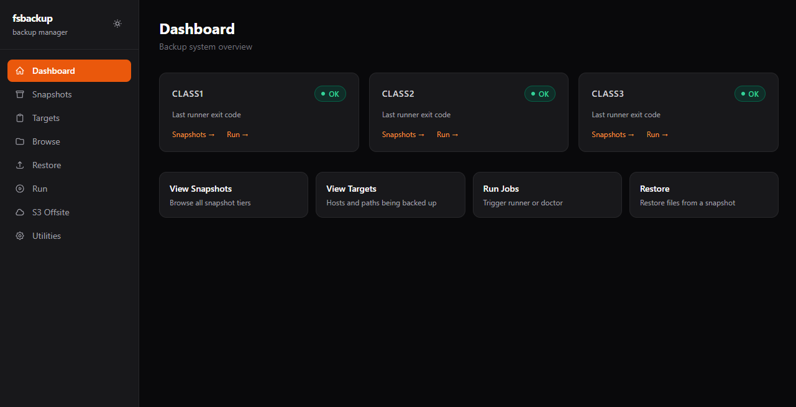
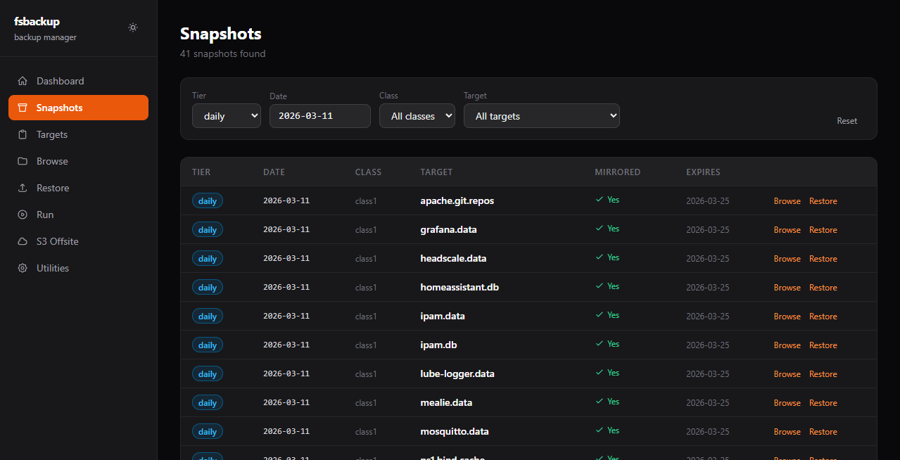
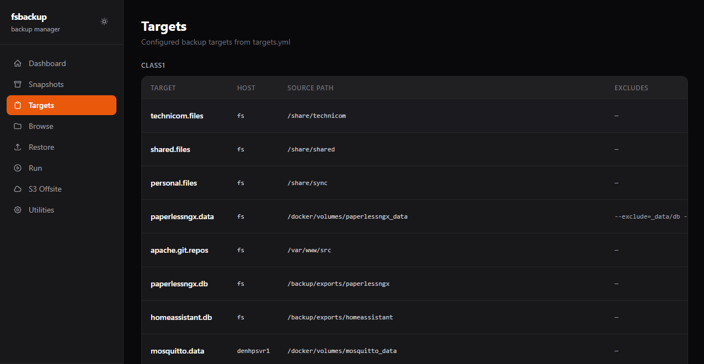
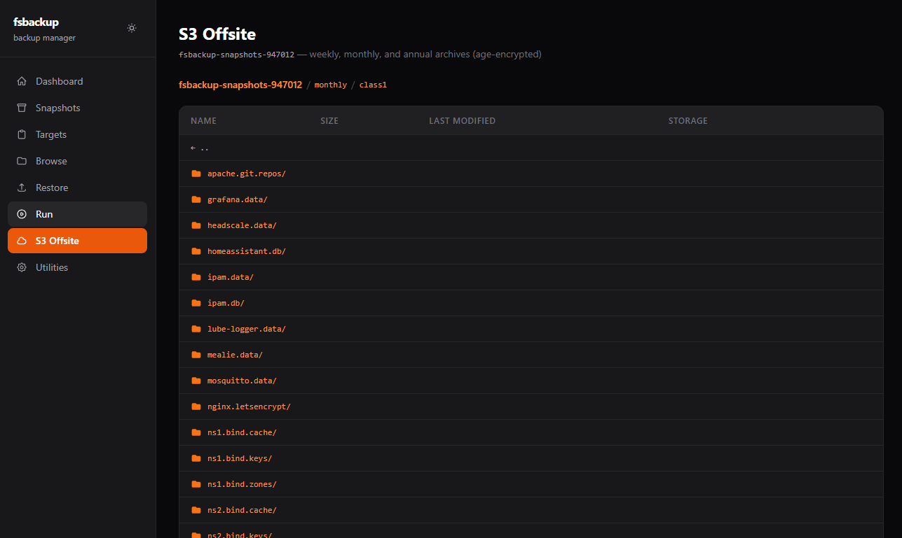
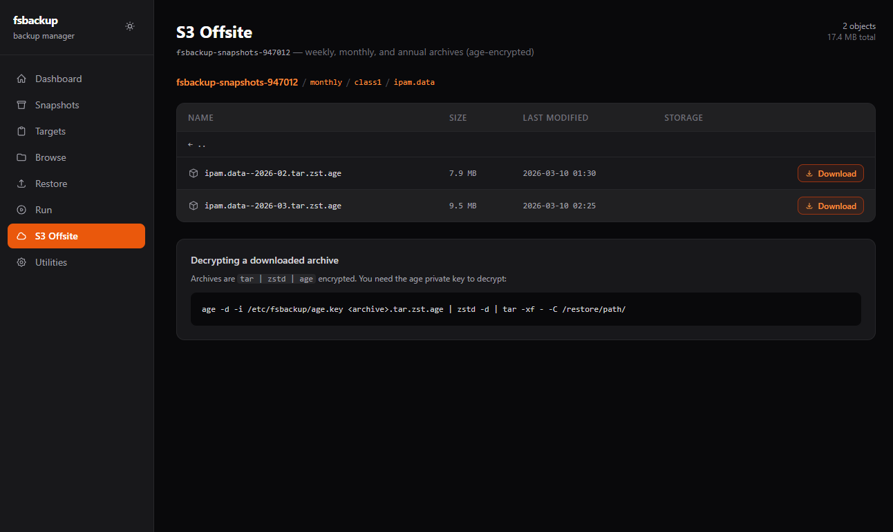
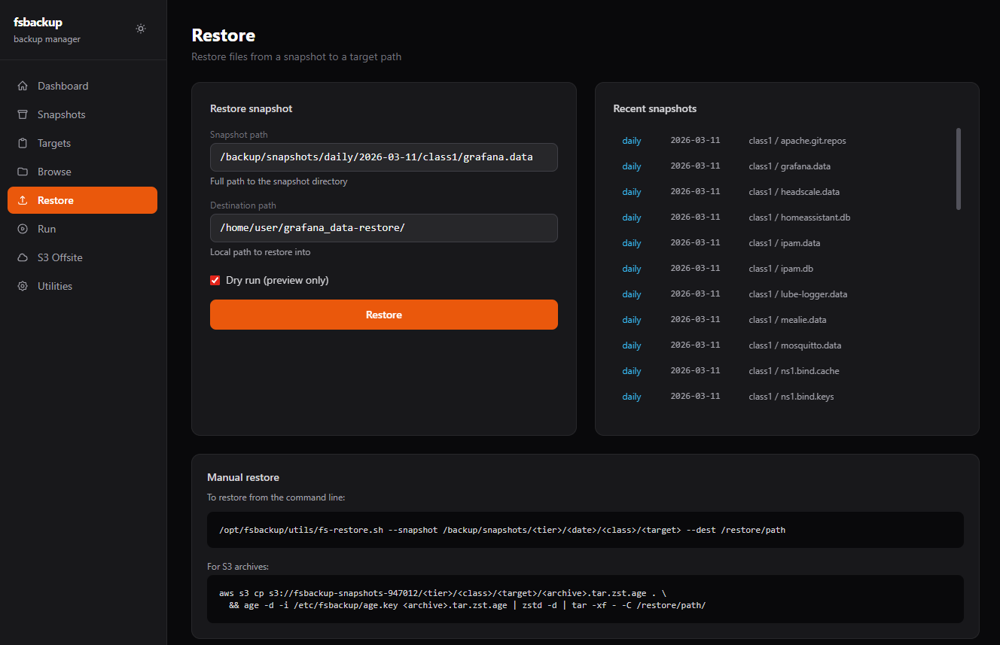
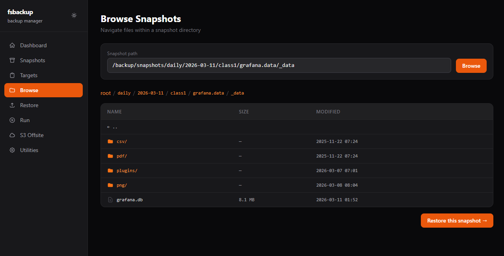

# fsbackup web UI

A lightweight read-mostly admin interface for the fsbackup system. Built with
FastAPI, HTMX, and Tailwind CSS. Runs as a systemd service on the backup server.

## Contents

- [Architecture](#architecture)
- [Pages and routes](#pages-and-routes)
- [How scripts and services are called](#how-scripts-and-services-are-called)
- [Configuration](#configuration)
- [Running locally](#running-locally)
- [Setup](#setup)
- [Permissions](#permissions)
- [Deploying as a systemd service](#deploying-as-a-systemd-service)
- [Dark / light mode](#dark--light-mode)
- [Extending the UI](#extending-the-ui)
- [Screenshots](#screenshots)

---

## Architecture

```
web/
  main.py              # FastAPI application — all routes and business logic
  requirements.txt     # Python dependencies
  .env.example         # Configuration template (copy to .env)
  static/              # Static assets (currently empty; Tailwind and HTMX are CDN)
  templates/
    base.html          # Shared layout: sidebar nav, dark/light toggle, CDN scripts
    index.html         # Dashboard
    snapshots.html     # Snapshot browser with live HTMX filters
    targets.html       # targets.yml viewer
    browse.html        # Filesystem browser inside a snapshot
    restore.html       # Restore form
    run.html           # Trigger systemd services
    s3.html            # S3 offsite bucket browser
    utilities.html     # Admin CLI tool reference cards
    partials/
      snapshot_rows.html   # HTMX swap target: snapshot table body
      dir_entries.html     # HTMX swap target: directory listing rows
      run_result.html      # HTMX swap target: inline start/error badge
```

### Stack

| Layer     | Technology | Notes |
|-----------|-----------|-------|
| Backend   | [FastAPI](https://fastapi.tiangolo.com/) | Async Python, served by uvicorn |
| Templates | [Jinja2](https://jinja.palletsprojects.com/) | Server-rendered HTML |
| Interactivity | [HTMX](https://htmx.org/) 1.9 | Swaps HTML fragments without a JS framework |
| Styles    | [Tailwind CSS](https://tailwindcss.com/) 3 (CDN) | No build step required |
| S3 client | [boto3](https://boto3.amazonaws.com/v1/documentation/api/latest/index.html) | Uses the `fsbackup` AWS profile |

Tailwind and HTMX are loaded from CDN in `base.html`. There is no frontend build
step and no Node.js requirement.

---

## Pages and routes

| Route | Page | Description |
|-------|------|-------------|
| `GET /` | Dashboard | Class status cards read from `.prom` metric files |
| `GET /snapshots` | Snapshots | Filterable table of all local snapshots; defaults to daily tier + today |
| `GET /targets` | Targets | Parsed view of `/etc/fsbackup/targets.yml`, grouped by class |
| `GET /browse` | Browse | Directory tree walker inside a snapshot path |
| `GET /restore` | Restore | Restore form with recent-snapshot quick-select sidebar |
| `GET /run` | Run | Trigger runner/doctor per class, promote, mirror |
| `GET /s3` | S3 Offsite | Prefix-based S3 bucket browser with presigned download |
| `GET /utilities` | Utilities | Reference cards for admin CLI tools (trust-host, rename, restore, etc.) |

### HTMX partial endpoints

| Route | Returns | Triggered by |
|-------|---------|--------------|
| `GET /api/snapshots` | `partials/snapshot_rows.html` | Filter change on `/snapshots` |
| `GET /api/tier-dates` | `<datalist>` HTML | Tier dropdown change on `/snapshots` |
| `GET /api/browse` | `partials/dir_entries.html` | *(reserved for future lazy tree)* |
| `GET /api/s3/download?key=…` | Redirect to presigned URL | Download button on `/s3` |
| `POST /api/run/{action}` | `partials/run_result.html` | Start buttons on `/run` |

---

## How scripts and services are called

### Systemd (Run page)

`POST /api/run/{action}` runs:

```python
subprocess.run(["systemctl", "start", "<unit>"], ...)
```

The process running the web UI must be able to call `systemctl start` for the
fsbackup units. If running as the `fsbackup` user, add sudoers entries:

```
fsbackup ALL=(root) NOPASSWD: /bin/systemctl start fsbackup-runner@*.service
fsbackup ALL=(root) NOPASSWD: /bin/systemctl start fsbackup-doctor@*.service
fsbackup ALL=(root) NOPASSWD: /bin/systemctl start fsbackup-promote.service
fsbackup ALL=(root) NOPASSWD: /bin/systemctl start fsbackup-mirror-daily.service
```

Then update the `api_run` handler to prepend `sudo` to the command.

### S3 (S3 Offsite page)

Uses boto3 with the `fsbackup` AWS profile (`/var/lib/fsbackup/.aws/credentials`).
`ListObjectsV2` is used to browse prefixes. Downloads generate a **presigned URL**
via `generate_presigned_url("get_object", ...)` — the browser fetches directly from
S3, nothing is proxied through the web server.

Presigned URLs expire after `PRESIGN_TTL` seconds (default: 3600).

### Restore (Restore page)

`POST /api/run/restore` runs rsync directly. The snapshot path is validated
against `SNAPSHOT_ROOT` and `MIRROR_ROOT` before execution. Dry-run mode
(default: on) passes `--dry-run --stats` to rsync and displays a preview without
modifying any files.

---

## Configuration

A `.env` file is **optional**. All variables have defaults baked into `main.py`
via `os.environ.get("VAR", "default")`, so the app starts with no configuration
at all and the defaults match a standard fsbackup installation.

Only create a `.env` if you need to override something:

```bash
cp web/.env.example web/.env
# edit web/.env as needed
```

The app loads `web/.env` automatically at startup via `python-dotenv`. When
running under systemd, you can use `EnvironmentFile=` in the unit file instead.

| Variable | Default | Description |
|----------|---------|-------------|
| `HOST` | `0.0.0.0` | Address to bind to |
| `PORT` | `8080` | Port to listen on |
| `SNAPSHOT_ROOT` | `/backup/snapshots` | Primary snapshot directory |
| `MIRROR_ROOT` | `/backup2/snapshots` | Mirror snapshot directory |
| `TARGETS_FILE` | `/etc/fsbackup/targets.yml` | targets.yml path |
| `S3_BUCKET` | `fsbackup-snapshots-SUFFIX` | S3 bucket name |
| `S3_PROFILE` | `fsbackup` | AWS credentials profile name |
| `S3_REGION` | `us-west-2` | AWS region |
| `PRESIGN_TTL` | `3600` | Presigned download URL expiry (seconds) |

> `HOST` and `PORT` are read by the `if __name__ == "__main__"` entrypoint in
> `main.py`. If you start the app via `uvicorn main:app` directly on the command
> line, pass `--host` and `--port` explicitly or export the variables first.

---

## Running locally

```bash
cd /opt/fsbackup/web
pip install -r requirements.txt

# Simplest — uses all defaults, no .env needed:
uvicorn main:app --reload

# Or via the entrypoint, which reads HOST/PORT from .env:
python3 main.py
```

The `--reload` flag restarts on file changes — remove it in production.

---

## Setup

Run `install.sh` as root to configure permissions, generate `.env`, install
dependencies, and optionally install the systemd service:

```bash
sudo bash /opt/fsbackup/web/install.sh
```

The script will:
1. Ask which user will run the web UI
2. Add that user to the `fsbackup` group (covers snapshot dirs and config files)
3. Apply ACLs for paths not covered by the group (Prometheus textfile dir, AWS credentials)
4. Add that user to the `systemd-journal` group (needed for the log viewer on the Run page)
5. Generate a `web/.env` with a random `SECRET_KEY`, prompting for host/port and auth settings
6. Create the Python venv and install dependencies
7. Optionally write and enable a systemd unit

## Permissions

The `fsbackup` group covers the main paths the app needs. `install.sh` handles
this automatically. If you need to understand or redo it manually:

| Path | Access needed | Covered by |
|------|--------------|------------|
| `/backup/snapshots` | read + traverse | `fsbackup` group |
| `/backup2/snapshots` | read + traverse | `fsbackup` group |
| `/etc/fsbackup/` | read + traverse | `fsbackup` group |
| `/var/lib/node_exporter/textfile_collector/` | read | ACL (set by install.sh) |
| `/var/lib/fsbackup/.aws/` | read | ACL (set by install.sh) |
| systemd journal | read | `systemd-journal` group (set by install.sh) |

The app sets `AWS_SHARED_CREDENTIALS_FILE` and `AWS_CONFIG_FILE` to point at
`/var/lib/fsbackup/.aws/` at startup, so boto3 finds the `fsbackup` AWS profile
regardless of which user runs the process.

---

## Deploying as a systemd service

The easiest way is to let `install.sh` write and install the unit for you — it
prompts during setup and uses the correct user, paths, and `.env` location.

To do it manually, create `/etc/systemd/system/fsbackup-web.service`:

```ini
[Unit]
Description=fsbackup web UI
After=network.target

[Service]
Type=simple
User=fsbackup
WorkingDirectory=/opt/fsbackup/web
ExecStart=/opt/fsbackup/web/.venv/bin/python3 /opt/fsbackup/web/main.py
EnvironmentFile=/opt/fsbackup/web/.env
Restart=on-failure
RestartSec=5

[Install]
WantedBy=multi-user.target
```

Then:

```bash
sudo systemctl daemon-reload
sudo systemctl enable --now fsbackup-web.service
```

---

## Dark / light mode

The toggle button in the top-right of the sidebar switches between dark and light
mode. The preference is saved in `localStorage` and applied before first paint to
avoid a flash.

---

## Extending the UI

- **New page**: add a route in `main.py`, create `templates/<page>.html` extending
  `base.html`, add the nav entry to the `nav` list in `base.html`.
- **New HTMX partial**: add a `GET /api/...` route returning a
  `TemplateResponse("partials/<name>.html", ...)`, target it with `hx-get` and
  `hx-target` in the calling template.
- **New utility**: add a card to `utilities.html` and a `POST /api/run/<action>`
  handler that calls the relevant script in `utils/`.

---

## Screenshots

 

 

 

 
